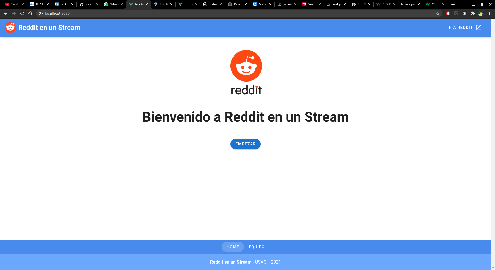
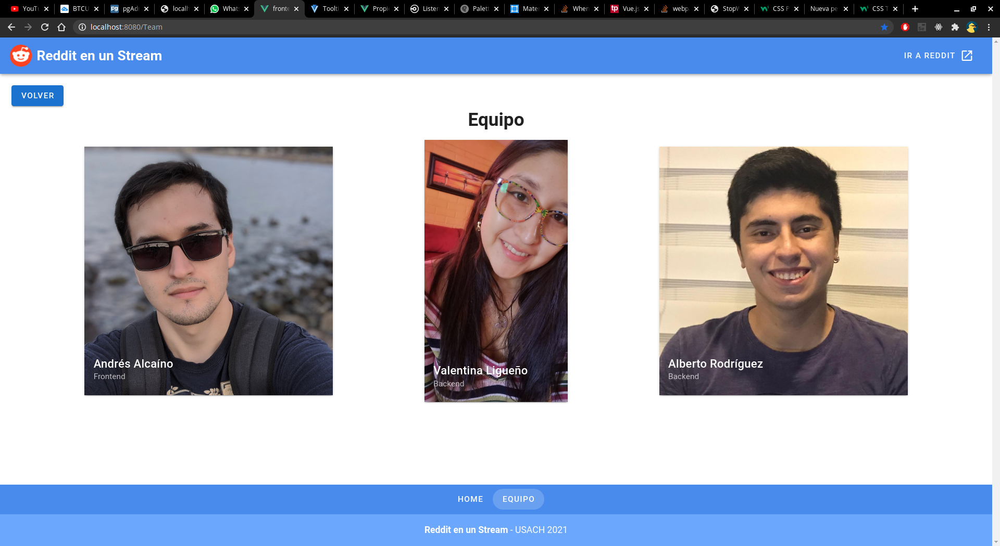
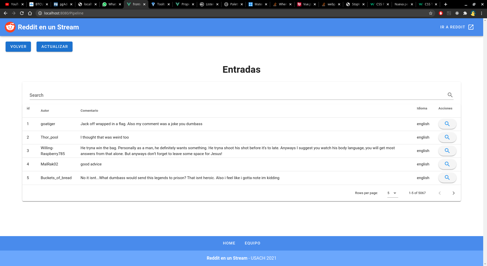
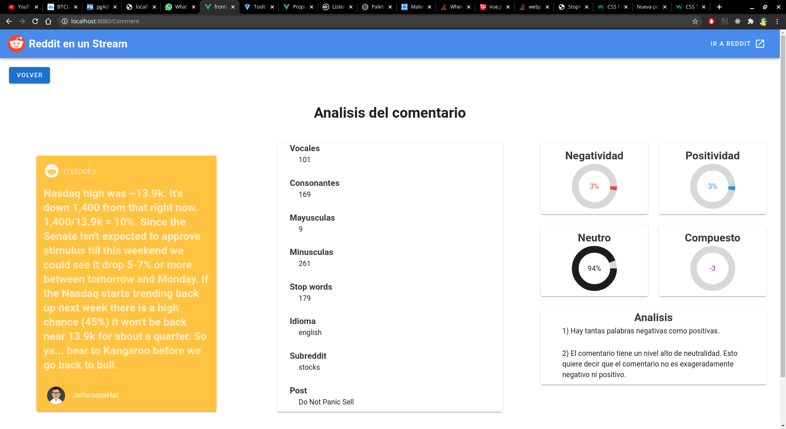
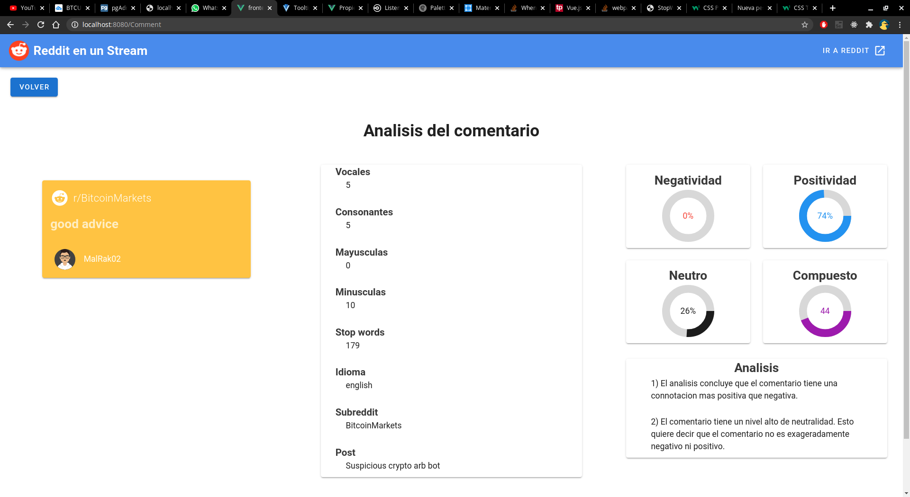

# Reddit-En-Un-Stream-KafkaNodeVue

## Equipo
- Andrés Alcaíno (Frontend)
- Valentina Ligueño (Backend)
- Alberto Rogríguez (Kafka)

## Sobre el proyecto

Mediante un pipeline que se ejecuta utilizando consumidores y productores de Kafka se obtienen los datos de una base de datos (MongoDB) con comentarios de reddit, se analizan
y se obtienen datos como cantidad de mayúsculas, stopwords, idioma, negatividad y positividad y se almacenan en otra base de datos (Postgresql).

Estos datos luego son observados en el frontend desarrollado en Vue.js + Vuetify, el cuál consume el Backend desarrollado en Node.js.

## Imágenes:

## Para compilar

### Requisitos:

tener installado Node, Docker, Docker-compose, npm, postgresql.

### Pipeline:

Ejecutar docker-compose de todos los arhivos yml tanto en la carpeta /Comentarios como en /Estadísticas

    docker-compose -f "Archivo.yml" up -d
    
Ejecutar con flag --build para kafka y databases

    docker-compose -f "docker-compose-kafka.yml" up -d --build

### Backend

Instalar

    npm install

Ejecutar

    npm run dev
    
### Frontend

Instalar

    npm install
    
Ejecutar

    npm run serve
